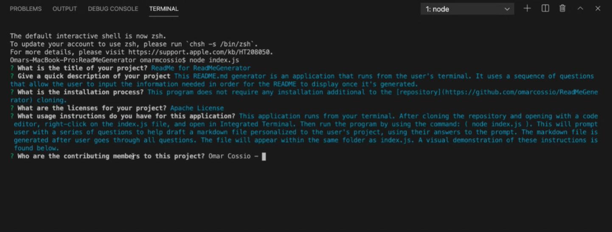
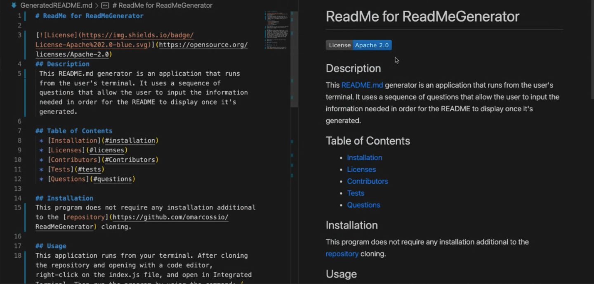

# README.md Generator

## Description 
This README.md Generator is an application that runs from the user's terminal. It uses a sequence of questions that allow the user to input the information needed in order for the README to display once it's generated. 

## Installation 
This program does not require any installation additional to the [repository](https://github.com/omarcossio/ReadMeGenerator) cloning. 

## Usage
This application runs from your terminal. After cloning the repository and opening with a code editor, right-click on the index.js file, and open in Integrated Terminal. Then run the program by using the command:  
```
 node index.js
```
 This will prompt user with a series of questions to help draft a markdown file personalized to the user's project, using their answers to the prompt. The markdown file is generated after user goes through all questions. The file will appear within the same folder as index.js. A visual demonstration of these instructions is found below.

## Visuals

Video Demo


<br>
Prompt Questions Screenshot

<br>
ReadMe Generator Results Screenshot

<br>

## Licenses
None

## Contributors
Omar Cossio -- Lead Developer

## Links
* [Sample ReadMe file generated via this application](/SAMPLEGeneratedREADME.md)
* [View code on Github](https://github.com/omarcossio/ReadMeGenerator)
* [View usage video](https://drive.google.com/file/d/1M98VVJFkoMxpI97bbOLhx_nc_R2-pRD3/view)

## Questions
For any questions feel free to contact me through one of the following: 
* [Omar's Github Profile](https://github.com/omarcossio)
* [Omar's LinkedIn](https://www.linkedin.com/in/omar-cossio-7b332a12b)